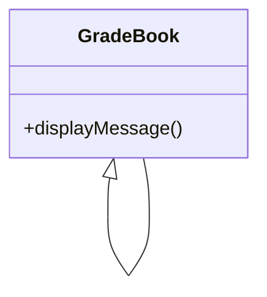
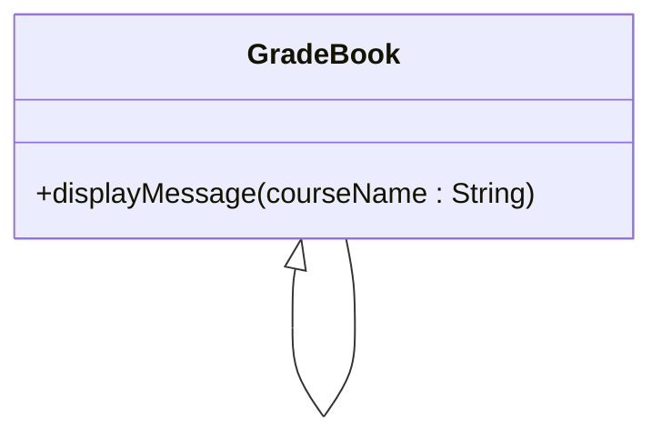
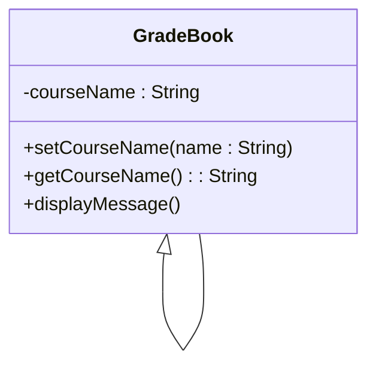
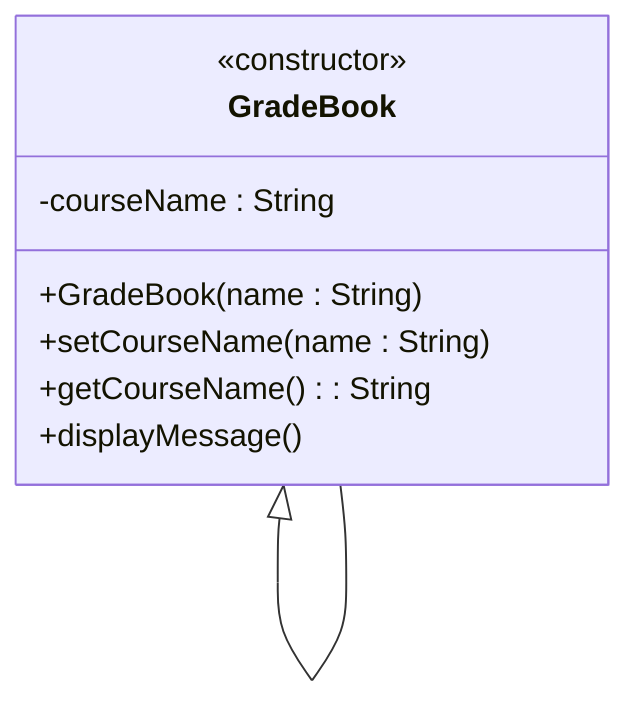

# Introduction to Classes, Objects and Strings

Typically, the programs you develop in C++ will consist of function main​ and one or more classes, each containing data members and member functions​

- Classes is an improvement to Data Structure​
- Data Structure can only store data members​
- Classes can store data members and functions (methods) with other characteristics manipulator

Example that consists of 
- class GradeBook which will represent a grade book that an instructor can use to maintain student test scores
- a main function that creates a GradeBook object:
```C++
#include <iostream>
using namespace std;

// GradeBook class definition
class GradeBook
{
public:
    // function that displays a welcome message to the GradeBook user
    void displayMessage()
    {
        cout << "Welcome to the Grade Book!" << endl;
    } // end function displayMessage
}; // end class GradeBook

// function main begins program execution
int main()
{
    GradeBook myGradeBook; // create a GradeBook object named myGradeBook
    myGradeBook.displayMessage(); // call object's displayMessage function
}
```
Function main uses this object and its member function to display a message on the screen welcoming the instructor to the grade-book program.

The GradeBook class definition contains a member function called displayMessage that displays a message on the screen.

- By convention, the name of a user-defined class begins with a capital letter, and for readability, each subsequent word in the class name begins with a capital letter. This capitalization style is often referred to as Camel case, because the pattern of uppercase and lowercase letters resembles the silhouette of a camel.

Recall that the function main is always called automatically when you execute a program​. Most functions do not get called automatically. As you’ll soon see, you must call member function displayMessage explicitly to tell it to perform its task

The keyword `public`, which is an access specifier. The member function displayMessage appears after access specifier public: to indicate that the function is “available to the public”—that is, it can be called by other functions in the program (such as main), and by member functions of other classes (if there are any)

UML Class Diagram for Class GradeBook:


The plus sign (+) in front of the operation name indicates that displayMessage is a public operation in the UML

# Defining a Member Function with a Parameter

```C++
#include <iostream>
using namespace std;

class GradeBook
{
public:
    void displayMessage(string courseName)
    {
        cout << "Welcome to the grade book for\n" << courseName << "!" << endl;
    }
};

int main()
{
    string nameOfCourse;
    GradeBook myGradeBook;

    cout << "Please enter the course name:" << endl;
    getline(cin, nameOfCourse);
    cout << endl;

    myGradeBook.displayMessage(nameOfCourse);
}
```
output:
```C++
Please enter the course name:
CSEB214 Object Oriented Programming

Welcome to the grade book for
CSEB214 Object Oriented Programming!
```

Updated UML Class Diagram for Class GradeBook:


# GradeBook Class with a Data Member, a set Function and a get Function

```C++
#include <iostream>
#include <string>
using namespace std;

class GradeBook
{
public:
    void setCourseName(string name)
    {
        courseName = name;
    }

    string getCourseName()
    {
        return courseName;
    }

    void displayMessage()
    {
        cout << "Welcome to the grade book for\n" << getCourseName() << "!" << endl;
    }
    private:
        string courseName;
};

int main()
{
    string nameOfCourse;
    GradeBook myGradeBook;

    cout << "Initial course name is: " << myGradeBook.getCourseName() << endl;

    cout << "\nPlease enter the course name:" << endl;
    getline(cin, nameOfCourse);
    cout << endl;

    myGradeBook.setCourseName(nameOfCourse);
    cout << endl;

    myGradeBook.displayMessage();
}
```
output:
```C++
Initial course name is:

Please enter the course name:
CSEB214 Object Oriented Programming

Welcome to the grade book for
CSEB214 Object Oriented Programming!
```

The class contains member functions setCourseName, getCourseName and displayMessage. 
- Member function setCourseName stores a course name in a GradeBook data member named courseName.
- Member function getCourseName returns the value of courseName to the function that called it.
- Member function displayMessage displays a welcome message by calling getCourseName to retrieve the course name.

# Access Specifiers public and private

Most data-member declarations appear after the private access specifier.

Variables or functions declared after access specifier private (and before the next access specifier if there is one) are accessible only to member functions of the class for which they’re declared (or to “friends” of the class, as you’ll see in Chapter 5).

Thus, data member courseName can be used only in member functions setCourseName, getCourseName and displayMessage of class GradeBook (or to “friends” of the class, if there were any).

The default access for class members is private so all members after the class header and before the first access specifier (if there are any) are private.

The access specifiers public and private may be repeated, but this is unnecessary and can be confusing.

Declaring data members with access specifier private is known as __data hiding.__

A member function that is declared with access specifier private is known as a __private member function__ or __Utility function.__

A member function that is declared with access specifier public is known as a __public member function__ or __Access function.__

There are three types of access specifiers/modifiers:
1. private members of a class are accessible only from within other members of the same class (or from their "friends"). If we do not specify any access specifier/modifier for the members inside the class then by default the access specifiers/modifier for the members will be Private.
2. protected members are accessible from other members of the same class (or from their "friends"), and from members of their derived classes.
3. public members are accessible from anywhere where the object is visible

# Software Engineering with Set and Get Functions

The set and get functions of a class also should be used by other member functions within the class to manipulate the class’s private data, although these member functions can access the private data directly.

For example,
- Member functions setCourseName and getCourseName are public member functions, so they’re accessible to clients of the class, as well as to the class itself. Member function displayMessage calls member function getCourseName to obtain the value of data member courseName for display purposes, eventhough displayMessage can access courseName directly—accessing a data member via its get function creates a better, more robust class.

A class’s private data members can be manipulated only by member functions of that class (and by “friends” of the class). So a client of an object—that is, any statement that calls the object’s member functions from outside the object—calls the class’s public member functions to request the class’s services for particular objects of the class.

This is why the statements in function main call member functions setCourseName, getCourseName and displayMessage on a GradeBook object. Classes often provide public member functions to allow clients of the class to set (i.e., assign values to) or get (i.e., obtain the values of) private data members.

GradeBook’s UML Class Diagram with a Data Member and set and get Functions:


# Initializing Objects with Constructors

When an object of class GradeBook is created, its data member courseName is initialized to the empty string by default.

What if you want to provide a course name when you create a GradeBook object?
- Each class you declare can provide a constructor that can be used to initialize an object of the class when the object is created.

 A constructor is a special member function that must be defined with the same name as the class, so that the compiler can distinguish it from the class’s other member functions.

 An important difference between constructors and other functions is that constructors cannot return values, so they cannot specify a return type (not even void).
 
 Normally, constructors are declared public.

 C++ requires a constructor call for each object that’s created, which helps ensure that each object is initialized properly before it’s used in a program.

 The constructor call occurs implicitly when the object is created. If a class does not explicitly include a constructor, the compiler provides a default constructor—that is, a constructor with no parameters.

 GradeBook object is created in line 31, the default constructor is called. The default constructor provided by the compiler creates a GradeBook object without giving any initial values to the object’s fundamental type data members. [Note: For data members that are objects of other classes, the default constructor implicitly calls each data member’s default constructor to ensure that the data member is initialized properly.]

 This is why the string data member courseName was initialized to the empty string—the default constructor for class string sets the string’s value to the empty string. You’ll learn more about initializing data members that are objects of other classes in future chapters.

 ```C++
#include <iostream>
#include <string>
using namespace std;

class GradeBook
{
    public:
        // constructor initializes courseName with string supplied as argument
        GradeBook(string name)
        {
            setCourseName(name);
        }

        void setCourseName(string name)
        {
            courseName = name;
        }

        string getCourseName()
        {
            return courseName;
        }

        void displayMessage()
        {
            cout << "Welcome to the grade book for\n" << getCourseName() << "!" << endl;
        }

    private:
        string courseName;
};

int main()
{
    // create two GradeBook objects
    GradeBook gradeBook1("CS101 Introduction to C++ Programming");
    GradeBook gradeBook2("CS102 Data Structures in C++");

    cout << "gradeBook1 created for course: " << gradeBook1.getCourseName() << "\ngradeBook2 created for course: " << gradeBook2.getCourseName() << endl;
}
```
output:
```C++
gradeBook1 created for course: CS101 Introduction to C++ Programming
gradeBook2 created for course: CS102 Data Structures in C++ Programming
```

## Two Ways to Provide a Default Constructor for a Class

Any constructor that takes no arguments is called a default constructor. A class can get a default constructor in one of two ways:

1. The compiler implicitly creates a default constructor in a class that does not define a constructor. Such a constructor does not initialize the class’s data members, but does call the default constructor for each data member that’s an object of another class. An uninitialized variable typically contains a “garbage” value. ​

2. You explicitly define a constructor that takes no arguments. Such a default constructor will call the default constructor for each data member that’s an object of another class and will perform additional initialization specified by you. 

Adding the Constructor to Class GradeBook’s UML Class Diagra:


# Placing a Class in a Separate File for Reusability

Programmers who wish to use our GradeBook class cannot simply include the file from the last example in another program. As you know, function main begins the execution of every program, and every program must have exactly one main function. they will get extra “baggage”—our main function and their programs will then have two main functions. Attempting to compile a program with two main functions produces an error when the compiler tries to compile the second main function it encounters. So, placing main in the same file with a class definition prevents that class from being reused by other programs. In this section, we demonstrate how to make class GradeBook reusable by separating it into another file from the main function.

## Headers

Each of the previous examples in the chapter consists of a single .cpp file, also known as a __source-code__ file, that contains a GradeBook class definition and a main function. When building an object-oriented C++ program, it’s customary to define reusable source code (such as a class) in a file that by convention has a .h filename extension known as a __header.__ 

Programs use #include preprocessor directives to include headers and take advantage of reusable software components, such as type string provided in the C++ Standard Library and user-defined types like class GradeBook.
```C++
#include <iostream>
#include <string>
#include "GradeBook.h"
```

Our next example separates the code to .h and .cpp. To help you prepare for the larger programs you’ll encounter later in this syllabus and in industry, we often use a separate source code file containing function main to test our classes (this is called a __driver program__).

## The GradeBook.h Header File

```C++
#include <iostream>
#include <string>
using namespace std;

class GradeBook
{
    public:
        GradeBook(string name)
        {
            setCourseName(name);
        }

        void setCourseName(string name)
        {
            courseName = name;
        }

        string getCourseName()
        {
            return courseName;
        }

        void displayMessage()
        {
            cout << "Welcome to the grade book for\n" << getCourseName() << "!" << endl;
        }

    private:
        string courseName;
};
```
A header such as GradeBook.h cannot be used as a complete program, because it does not contain a main function. 

## The main.cpp Source Code File

```C++
#include <iostream>
#include "GradeBook.h"
using namespace std;

int main()
{
    GradeBook gradeBook1("CS101 Introduction to C++ Programming");
    GradeBook gradeBook2("CS102 Data Structures in C++");

    cout << "gradeBook1 created for course: " << gradeBook1.getCourseName() << "\ngradeBook2 created for course: " << gradeBook2.getCourseName() << endl;
}
```
Notice that the name of the GradeBook.h header is enclosed in quotes (" ") rather than angle brackets (< >). Normally, a program’s source-code files and user-defined headers are placed in the same directory.

When the preprocessor encounters a header name in quotes, it attempts to locate the header in the same directory as the file in which the #include directive appears. If the preprocessor cannot find the header in that directory, it searches for it in the same location(s) as the C++ Standard Library headers.

# Separating the Interface from the Implementation (GradeBook.h, GradeBook.cpp, main.cpp)

## The GradeBook.h Header File

```C++
#include <iostream>
#include <string>
using namespace std;

class GradeBook
{
    public:
        GradeBook(string); // constructor initializes courseName
        void setCourseName(string); // function to set the course name
        string getCourseName(); // function to retrieve the course name
        void displayMessage(); // display a welcome message
    private:
        string courseName; 
};
```

## The GradeBook.cpp Source Code File

```C++
#include <iostream>
#include "GradeBook.h" // include definition of class GradeBook from GradeBook.h
using namespace std;

// constructor initializes courseName with string supplied as argument
GradeBook::GradeBook(string name)
{
    setCourseName(name);
}

// function to set the course name
void GradeBook::setCourseName(string name)
{
    courseName = name;
}

// function to retrieve the course name
string GradeBook::getCourseName()
{
    return courseName;
}

// display a welcome message to the GradeBook user
void GradeBook::displayMessage()
{
    cout << "Welcome to the grade book for\n" << getCourseName() << "!" << endl;
}
```

## The main.cpp Source Code File

```C++
#include <iostream>
#include "GradeBook.h" // include definition of class GradeBook from GradeBook.h
using namespace std;

int main()
{
    GradeBook gradeBook1("CS101 Introduction to C++ Programming");
    GradeBook gradeBook2("CS102 Data Structures in C++");

    cout << "gradeBook1 created for course: " << gradeBook1.getCourseName() << "\ngradeBook2 created for course: " << gradeBook2.getCourseName() << endl;
}
```

# Validating Data with set Functions(Gradebook.h, Gradebook.cpp, main.cpp)

GradeBook.h:
```C++
#include <iostream>
#include <string>
using namespace std;

class GradeBook
{
    public:
        GradeBook(string); // constructor initializes courseName
        void setCourseName(string); // function to set the course name
        string getCourseName(); // function to retrieve the course name
        void displayMessage(); // display a welcome message
    private:
        string courseName; 
};
```

GradeBook.cpp:
```C++
#include <iostream>
#include "GradeBook.h" // include definition of class GradeBook from GradeBook.h
using namespace std;

// constructor initializes courseName with string supplied as argument
GradeBook::GradeBook(string name)
{
    setCourseName(name);
}

// function to set the course name
// ensures that the course name has at most 25 characters
void GradeBook::setCourseName(string name)
{
    if (name.length() <= 25)
        courseName = name;
    if (name.length() > 25)
    {
        courseName = name.substr(0, 25); // select first 25 characters and ignore the rest
        cout << "Name \"" << name << "\" exceeds maximum length (25).\nLimiting courseName to first 25 characters.\n" << endl;
    }
}

// function to retrieve the course name
string GradeBook::getCourseName()
{
    return courseName;
}

// display a welcome message to the GradeBook user
void GradeBook::displayMessage()
{
    cout << "Welcome to the grade book for\n" << getCourseName() << "!" << endl;
}
```

main.cpp:
```C++
#include <iostream>
#include "GradeBook.h" // include definition of class GradeBook from GradeBook.h
using namespace std;

int main()
{
    // create two GradeBook objects:
    // initialize courseName of gradeBook1 is too long
    GradeBook gradeBook1("CS101 Introduction to C++ Programming");
    GradeBook gradeBook2("CS102 Data Structures in C++");

    // display initial value of courseName for each GradeBook
    cout << "gradeBook1 created for course: " << gradeBook1.getCourseName() << "\ngradeBook2 created for course: " << gradeBook2.getCourseName() << endl;

    //modify courseName of gradeBook1(with a valid-length string)
    gradeBook1.setCourseName("CS101 C++ Programming");

    // display new value of courseName for each GradeBook
    cout << "\ngradeBook1 course name is: " << gradeBook1.getCourseName() << "\ngradeBook2 course name is: " << gradeBook2.getCourseName() << endl;
}
```
output:
```
Name "CS101 Introduction to C++ Programming" exceeds maximum length (25).
Limiting courseName to first 25 characters.

gradeBook1 created for course: CS101 Introduction to C++
gradeBook2 created for course: CS102 Data Structures in C++

gradeBook1 course name is: CS101 C++ Programming
gradeBook2 course name is: CS102 Data Structures in C++
```

# Access Functions and Utility Functions

Access functions can read or display data. Another common use for access functions is to test the truth or falsity of conditions—such functions are often called predicate functions.​

The next program demonstrates the notion of a utility function (also called a helper function). A utility function is not part of a class’s public interface; rather, it’s a private member function that supports the operation of the class’s other member functions. Utility functions are not intended to be used by clients of a class (but can be used by friends of a class, as we’ll see in Chapter 5).​

Class SalesPerson declares an array of 12 monthly sales figures and the prototypes for the class’s constructor and member functions that manipulate the array.

## Utility Functions

### SalesPerson.h

```C++
#ifndef SALESPERSON_H
#define SALESPERSON_H

class SalesPerson
{
    public:
        static const int monthsPerYear = 12; // months in one year
        SalesPerson(); // constructor
        void getSalesFromUser(); // input sales from keyboard
        void setSales(int, double); // set sales for a specific month
        void printAnnualSales(); // summarize and print sales
    private:
        double totalAnnualSales(); // prototype for utility function
        double sales[monthsPerYear]; // 12 monthly sales figures
};

#endif
```

### SalesPerson.cpp

```C++
//SalesPerson class member-function definitions
#include <iostream>
#include "SalesPerson.h" // include class definition
#include <iomanip>
using namespace std;

//initialize elements of array sales to 0.0
SalesPerson::SalesPerson()
{
    for (int i = 0; i < monthsPerYear; ++i)
        sales[i] = 0.0;
}

//get 12 sales figures from the user at the keyboard
void SalesPerson::getSalesFromUser()
{
    double salesFigure;
    for (int i = 1; i < monthsPerYear; ++i)
    {
        cout << "Enter sales amount for month" << i << ": ";
        cin >> salesFigure;
        setSales(i, salesFigure);
    }
}// end function getSalesFromUser

//set one of the 12 monthly sales figures; function subtracts 1 from month value for proper subscript in sales array
void SalesPerson::setSales(int month, double amount)
{
    //test for valid month and amount values
    if (month >= 1 && month <= monthsPerYear && amount > 0)
        sales[month - 1] = amount; //adjust for subscripts 0-11
    else //invalid month or amount value
        cout << "Invalid month or sales figure" << endl;
}// end function setSales

//print total annual sales (with the help of utility function)
void SalesPerson::printAnnualSales()
{
    cout << setprecision(2) << fixed
         << "\nThe total annual sales are: $" << totalAnnualSales() << endl; //call utility function
}// end function printAnnualSales

//private utility function to total annual sales
double SalesPerson::totalAnnualSales()
{
    double total = 0.0; //initialize total
    for (int i = 0; i < monthsPerYear; ++i) //summarize sales results
        total += sales[i]; //add month i sales to total
    return total;
}// end function totalAnnualSales
```

### main.cpp

```C++
// Utility function demonstration.
// Compile this program with SalesPerson.cpp
// include Salesperson class definition from Salesperson.h
#include "Salesperson.h"

int main()
{
    SalesPerson s; // create SalesPerson object s
    s.getSalesFromUser(); // note simple sequential code; there are
    s.printAnnualSales(); // no control statements in main
}
```
Output:
```
Enter sales amount for month1: 1000
Enter sales amount for month2: 2000
Enter sales amount for month3: 3000
Enter sales amount for month4: 4000
Enter sales amount for month5: 5000
Enter sales amount for month6: 6000
Enter sales amount for month7: 7000
Enter sales amount for month8: 8000
Enter sales amount for month9: 9000
Enter sales amount for month10: 10000
Enter sales amount for month11: 11000
Enter sales amount for month12: 12000

The total annual sales are: $66000.00
```

# Preprocessor Wrapper

In SalesPerson.h
```C++
// prevent multiple inclusions of header
#ifndef SALESPERSON_H
#define SALESPERSON_H
....
#endif
```
When we build larger programs, other definitions and declarations will also be placed in headers. The preceding preprocessor wrapper prevents the code between #ifndef(which means “if not defined”) and #endiffrom being included if the name SALESPERSON_H has been defined.

If the header has not been included previously in a file, the name SALESPERSON_H is defined by the #define directive and the header statements are included. If the header has been included previously, SALESPERSON_H is defined already and the header is not included again. Attempts to include a header multiple times (inadvertently) typically occur in large programs with many headers that may themselves include other headers.

# Composition and Inheritance

Often, classes do not have to be created “from scratch.” Rather, they can include objects of other classes as members or they may be derived from other classes that provide attributes and behaviors the new classes can use. Such software reuse can greatly enhance productivity and simplify code maintenance.

Including class objects as members of other classes is called __composition__
Deriving new classes from existing classes is called __inheritance__

# Object size

People new to object-oriented programming often suppose that objects must be quite large because they contain data members and member functions.

Logically, this is true—you may think of objects as containing data and functions (and our discussion has certainly encouraged this view); physically, however, this is not true

Objects contain only data, so objects are much smaller than if they also contained member functions. Applying operator sizeof to a class name or to an object of that class will report only the size of the class’s data members.

The compiler creates one copy (only) of the member functions separate from all objects of the class. All objects of the class share this one copy.

Each object, of course, needs its own copy of the class’s data, because the data can vary among the objects. The function code is nonmodifiable and, hence, can be shared among all objects of one class.

# Class Scope and Accessing Class Members

```C++
// Demonstrating the class member access operators . and ->
#include <iostream>
using namespace std;

// class Count definition
class Count {
public: // public data is dangerous
    // sets the value of private data member x
    void setX( int value)
    {
        x = value;
    } // end function setx

    // prints the value of private data member x
    void print()
    {
        cout << x << endl;
    } //end function print

private:
    int x;
}; // end class Count

// function main begins program execution
int main(void)
{
    Count counter; // create counter object
    Count *counterPtr = &counter; // create pointer to counter
    Count &counterRef = counter; // create reference to counter

    cout << "Set x to 1 and print using the object's name: ";
    counter.setX( 1 ); // set data member x to 1
    counter.print(); // call member function print

    cout << "Set x to 2 and print using a reference to an object: ";
    counterRef.setX( 2 ); // set data member x to 2
    counterRef.print(); // call member function print

    cout<<"Print using object's name instead of reference: ";
    counter.print(); // call member function print

    cout << "Set x to 3 and print using a pointer to an object: ";
    counterPtr->setX( 3 ); // set data member x to 3
    counterPtr->print(); // call member function print
}
```
Output:
```
Set x to 1 and print using the object's name: 1
Set x to 2 and print using a reference to an object: 2
Print using object's name instead of reference: 2
Set x to 3 and print using a pointer to an object: 3
```

# Constructors with Default Arguments

Like other functions, constructors can specify default arguments. 

The default arguments to the constructor ensure that, even if no values are provided in a constructor call, the constructor still initializes the data members.

A constructor that defaults all its arguments is also a default constructor—that is, a constructor that can be invoked with no arguments. There can be at most one default constructor per class.

### Test.h
```C++
#ifndef TIME_H
#define TIME_H

class Test
{
public:
    Test(double = 0.0, double = 0.0, double = 0.0 );
    void Display();
private:
    double test1;
    double test2;
    double test3;
    double CalculateTotal();
};

#endif
```

### Test.cpp
```C++
#include <iostream>
#include "test.h"
#include<iomanip>
using namespace std;

Test::Test(double t1, double t2, double t3)
{
    test1 = t1;
    test2= t2;
    test3 = t3;
}

double Test::CalculateTotal()
{
    return test1+test2+test3;
}

void Test::Display()
{
    cout<<"The total for all 3 tests is: "<<showpoint<< setw(10) <<right<<
        setprecision(2) << fixed <<Calculate Total() << endl;
}
```

### main.cpp
```C++
#include <iostream>
#include "test.h"
#include<iomanip>

void main (void)
{
    Test t1;
    Test t2(5);
    Test t3(5, 7);
    Test t4(5, 9, 10);

    t1.Display();
    t2.Display();
    t3.Display();
    t4.Display();

    system("pause");
}
```
Output:
```
The total for all 3 tests is: 0.00
The total for all 3 tests is: 5.00
The total for all 3 tests is: 12.00
The total for all 3 tests is: 24.00
```

# Destructors

destructor is another type of special member function. The name of the destructor for a class is the tilde character (~) followed by the class name.

This naming convention has intuitive appeal, because as we’ll see in a later chapter, the tilde operator is the bitwise complement operator, and, in a sense, the destructor is the complement of the constructor.

A class’s destructor is called implicitly when an object is destroyed. This occurs, for example, as an automatic object is destroyed when program execution leaves the scope in which that object was instantiated. The destructor itself does not actually release the object’s memory—it performs termination housekeeping before the object’s memory is reclaimed, so the memory may be reused to hold new objects.

Even though destructors have not been provided for the classes presented so far, every class has a destructor. If you do not explicitly provide a destructor, the compiler creates an “empty” destructor.

[Note: We’ll see that such an implicitly created destructor does, in fact, perform important operations on objects that are created through composition]

## Destructor with auto vs static objects

When a function ends all auto objects are destroyed in reverse order of creation(Stack, last in first out). When a program ends all static objects are destroyed in reverse order of creation.

```C++
#include <iostream>
using namespace std;

class AutoVsStatic
{
public:
    AutoVsStatic(int i, string num)
    {
        x = i;
        s = num;
        cout << x << "&" << s << " Created" << endl;
    }
    ~AutoVsStatic()
    {
        cout << x << "&" << s << " Destroyed" << endl;
    }

private:
    int x;
    string s;
};

void func()
{
    AutoVsStatic a(4, "four"); 
    static AutoVsStatic b(5, "five");
    AutoVsStatic c(6, "six"); // 4) all objects are created in the order they are declared 
} // 5) function ends. therefor, all objects (EXCEPT STATIC) are destroyed in reverse order of creation

int main()
{
    AutoVsStatic a(1, "one");// 2) then main function is called and all objects before the next function call are created
    static AutoVsStatic b(2, "two");
    func(); // 3) then func() is called hence we go to that function and execute it before returning to main
    AutoVsStatic c(3, "three"); // 6) we return to main and create the last object

    return 0;
}

AutoVsStatic z(0, "zero"); // 1) global varibles are always created first, and they are STATIC BY DEFAULT
```
Output:
```
0&zero Created
1&one Created
2&two Created
4&four Created
5&five Created
6&six Created
6&six Destroyed
4&four Destroyed
3&three Created
3&three Destroyed
1&one Destroyed
5&five Destroyed
2&two Destroyed
0&zero Destroyed
```

# When Constructors and Destructors Are Called

Constructors and Destructors are called implicitly by the compiler. The order in which these function calls occur depends on the order in which execution enters and leaves the scopes where the objects are instantiated.

Generally, destructor calls are made in the reverse order of the corresponding constructor calls, but as we’ll see in next examples, the storage classes of objects can alter the order in which destructors are called.

## Constructors and Destructors for Objects in Global Scope

Constructors are called for objects defined in global scope before any other function (including main) in that file begins execution (although the order of execution of global object constructors between files is not guaranteed).

The corresponding destructors are called when main terminates. Function exit forces a program to terminate immediately and does not execute the destructors of automatic objects.

The function often is used to terminate a program when an error is detected in the input or if a file to be processed by the program cannot be opened. Function abort performs similarly to function exit but forces the program to terminate immediately, without allowing the destructors of any objects to be called. Function abort is usually used to indicate an abnormal termination of the program.

## Constructors and Destructors for Local Automatic Objects

The constructor for an automatic local object is called when execution reaches the point where that object is defined—the corresponding destructor is called when execution leaves the object’s scope (i.e., the block in which that object is defined has finished executing).

Constructors and destructors for automatic objects are called each time execution enters and leaves the scope of the object. Destructors are not called for automatic objects if the program terminates with a call to function exit or function abort.

## Constructors and Destructors for static Local Objects

The constructor for a static local object is called only once, when execution first reaches the point where the object is defined—the corresponding destructor is called when main terminates or the program calls function exit.

Global and static objects are destroyed in the reverse order of their creation. Destructors are not called for static objects if the program terminates with a call to function abort.

### CreateAndDestroy.h
```C++
// CreateAndDestroy class definition.
// Member functions defined in CreateAndDestroy.cpp.
#include <string>
using namespace std;

#ifndef CREATE_H
#define CREATE_H

class CreateAndDestroy
{
public:
   CreateAndDestroy( int, string ); // constructor
   ~CreateAndDestroy(); // destructor
private:
    int objectID; // ID number for object
    string message; // message describing object
    }; //end class CreateAndDestroy

#endif
```

### CreateAndDestroy.cpp
```C++
// CreateAndDestroy class member-function definitions.
#include <iostream>
#include "CreateAndDestroy.h" // include CreateAndDestroy class definition
using namespace std;

// constructor
CreateAndDestroy::CreateAndDestroy( int ID, string messageString)
{
    objectID = ID; // set object's ID number
    message= messageString; // set object's descriptive message

    cout << "Object " << objectID << " constructor runs "
        << message << endl;
} //end CreateAndDestroy constructor
// destructor
CreateAndDestroy::~CreateAndDestroy()
{
    // output newline for certain objects; helps readability
    cout << (objectID == 1 || objectID == 6 ? "\n" : "");

    cout << "Object " << objectID << " destructor runs "
        << message << endl;
} //end CreateAndDestroy destructor
```

### main.cpp
```C++
// destructors are called.
#include <iostream>
#include "CreateAndDestroy.h" // include CreatedDestroy class definition
using namespace std;

void create(); // function prototype
CreateAndDestroy first(1, "(global before main)"); // global object

int main()
{
    cout << "MAIN FUNCTION: EXECUTION BEGINS" << endl;
    CreateAndDestroy second( 2, "(local automatic in main)");
    static CreateAndDestroy third( 3, "(local static in main)");

    create(); // call function to create objects

    cout << "MAIN FUNCTION: EXECUTION RESUMES" << endl;
    CreateAndDestroy fourth( 4, "(local automatic in main)");
    cout << "MAIN FUNCTION: EXECUTION ENDS" << endl;
} // end main

// function to create objects
void create()
{
    cout << "CREATE FUNCTION: EXECUTION BEGINS" << endl;
    CreateAndDestroy fifth( 5, "(local automatic in create)" );
    static CreateAndDestroy sixth( 6, "(local static in create)");
    CreateAndDestroy seventh( 7, "(local automatic in create)");
    cout << "CREATE FUNCTION: EXECUTION ENDS" << endl;
} // end function create
```

# Default Memberwise Assignment

The assignment operator (=) can be used to assign an object to another object of the same type. By default, such assignment is performed by memberwise assignment—each data member of the object on the right of the assignment operator is assigned individually to the same data member in the object on the left of the assignment operator.

However, Memberwise assignment can cause serious problems when used with a class whose data members contain pointers to dynamically allocated memory.

### dma.h
```C++
#ifndef DATE_H
#define DATE_H

class Date
{
public:
    Date( int = 1, int = 1, int = 2000 ); // default constructor
    void print();
private:
    int month; // 1-12 (January-December)
    int day; // 1-31 based on month
    int year; // any year
}; // end class Date

#endif
```

### dma.cpp
```C++
// Date constructor (should do range checking)
#include <iostream>
#include "Date.h" // include Date class definition
using namespace std;

Date::Date( int m, int d, int y )
{
    month = m;
    day = d;
    year = y;
} // end Date constructor

// print Date object in form month/day/year
void Date::print()
{
    cout << month << '/' << day << '/' << year;
} // end function print
```

### main.cpp
```C++
#include <iostream>
#include "Date.h" // include Date class definition
using namespace std;

int main()
{
    Date date1( 7, 4, 2004 ); // instantiate object date1
    Date date2; // instantiate object date2

    cout << "date1 = ";
    date1.print();
    cout << "\ndate2 = ";
    date2.print();

    cout << "\n\nAssigning date1 to date2:" << endl;

    date2 = date1; // Default memberwise assignment

    cout << "date1 = ";
    date1.print();
    cout << "\ndate2 after default memberwise assignment = ";
    date2.print();

    cout << endl;
} // end main
```

# CHHEAT SHEET

The error message suggests that the linker is still unable to find the definitions for the `GetPointers()`, `display()`, and `Student(string)` member functions of the `Student` class. 

One possible reason for this error could be that the order of compilation is incorrect. In C++, the order of compilation matters, and the dependent files should be listed after the files on which they depend.

Here is the correct order of compilation for your files:
```
g++ -c student.cpp
g++ -c main.cpp
g++ -o program main.o student.o
```

This command sequence first compiles `student.cpp` and `main.cpp` separately into object files `student.o` and `main.o`, respectively, and then links them together to create the executable `program`.

Make sure that you run these commands in the same directory where your files `main.cpp` and `student.cpp` are located.

After this, try running the executable `program` again, and it should run without any errors.

```
./program
```

