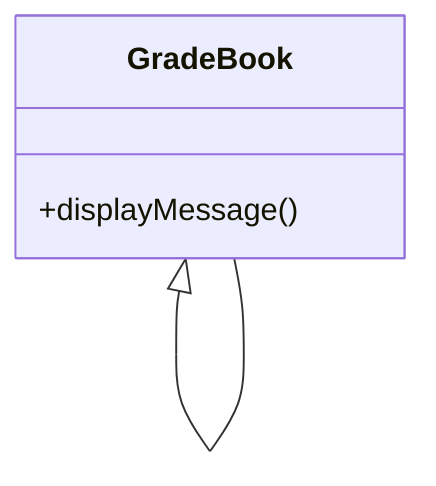
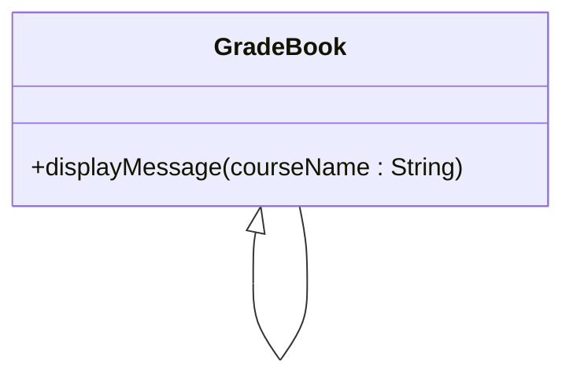
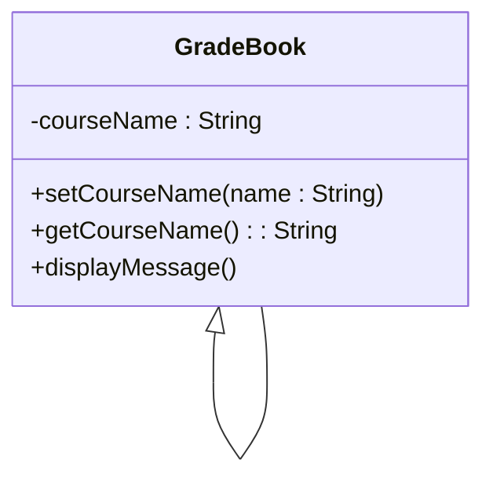
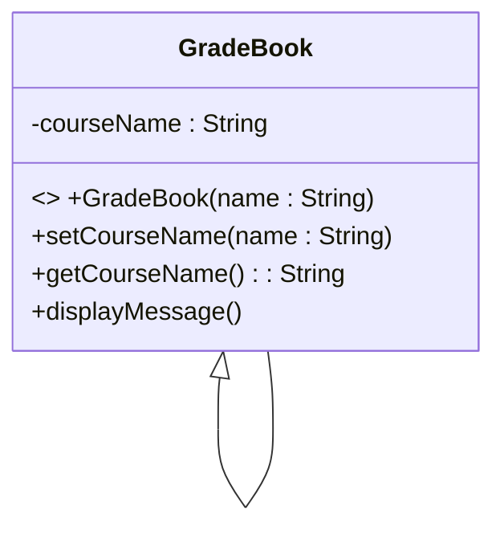

# Introduction to Classes, Objects and Strings

Typically, the programs you develop in C++ will consist of function main​ and one or more classes, each containing data members and member functions​

- Classes is an improvement to Data Structure​
- Data Structure can only store data members​
- Classes can store data members and functions (methods) with other characteristics manipulator

Example that consists of 
- class GradeBook which will represent a grade book that an instructor can use to maintain student test scores
- a main function that creates a GradeBook object:
```C++
#include <iostream>
using namespace std;

// GradeBook class definition
class GradeBook
{
public:
    // function that displays a welcome message to the GradeBook user
    void displayMessage()
    {
        cout << "Welcome to the Grade Book!" << endl;
    } // end function displayMessage
}; // end class GradeBook

// function main begins program execution
int main()
{
    GradeBook myGradeBook; // create a GradeBook object named myGradeBook
    myGradeBook.displayMessage(); // call object's displayMessage function
}
```
Function main uses this object and its member function to display a message on the screen welcoming the instructor to the grade-book program.

The GradeBook class definition contains a member function called displayMessage that displays a message on the screen.

- By convention, the name of a user-defined class begins with a capital letter, and for readability, each subsequent word in the class name begins with a capital letter. This capitalization style is often referred to as Camel case, because the pattern of uppercase and lowercase letters resembles the silhouette of a camel.

Recall that the function main is always called automatically when you execute a program​. Most functions do not get called automatically. As you’ll soon see, you must call member function displayMessage explicitly to tell it to perform its task

The keyword `public`, which is an access specifier. The member function displayMessage appears after access specifier public: to indicate that the function is “available to the public”—that is, it can be called by other functions in the program (such as main), and by member functions of other classes (if there are any)

UML Class Diagram for Class GradeBook:


The plus sign (+) in front of the operation name indicates that displayMessage is a public operation in the UML

# Defining a Member Function with a Parameter

```C++
#include <iostream>
using namespace std;

class GradeBook
{
public:
    void displayMessage(string courseName)
    {
        cout << "Welcome to the grade book for\n" << courseName << "!" << endl;
    }
};

int main()
{
    string nameOfCourse;
    GradeBook myGradeBook;

    cout << "Please enter the course name:" << endl;
    getline(cin, nameOfCourse);
    cout << endl;

    myGradeBook.displayMessage(nameOfCourse);
}
```
output:
```C++
Please enter the course name:
CSEB214 Object Oriented Programming

Welcome to the grade book for
CSEB214 Object Oriented Programming!
```

Updated UML Class Diagram for Class GradeBook:


# GradeBook Class with a Data Member, a set Function and a get Function

```C++
#include <iostream>
#include <string>
using namespace std;

class GradeBook
{
public:
    void setCourseName(string name)
    {
        courseName = name;
    }

    string getCourseName()
    {
        return courseName;
    }

    void displayMessage()
    {
        cout << "Welcome to the grade book for\n" << getCourseName() << "!" << endl;
    }
    private:
        string courseName;
};

int main()
{
    string nameOfCourse;
    GradeBook myGradeBook;

    cout << "Initial course name is: " << myGradeBook.getCourseName() << endl;

    cout << "\nPlease enter the course name:" << endl;
    getline(cin, nameOfCourse);
    cout << endl;

    myGradeBook.setCourseName(nameOfCourse);
    cout << endl;

    myGradeBook.displayMessage();
}
```
output:
```C++
Initial course name is:

Please enter the course name:
CSEB214 Object Oriented Programming

Welcome to the grade book for
CSEB214 Object Oriented Programming!
```

The class contains member functions setCourseName, getCourseName and displayMessage. 
- Member function setCourseName stores a course name in a GradeBook data member named courseName.
- Member function getCourseName returns the value of courseName to the function that called it.
- Member function displayMessage displays a welcome message by calling getCourseName to retrieve the course name.

# Access Specifiers public and private

Most data-member declarations appear after the private access specifier.

Variables or functions declared after access specifier private (and before the next access specifier if there is one) are accessible only to member functions of the class for which they’re declared (or to “friends” of the class, as you’ll see in Chapter 5).

Thus, data member courseName can be used only in member functions setCourseName, getCourseName and displayMessage of class GradeBook (or to “friends” of the class, if there were any).

The default access for class members is private so all members after the class header and before the first access specifier (if there are any) are private.

The access specifiers public and private may be repeated, but this is unnecessary and can be confusing.

Declaring data members with access specifier private is known as __data hiding.__

A member function that is declared with access specifier private is known as a __private member function__ or __Utility function.__

There are three types of access specifiers/modifiers:
1. private members of a class are accessible only from within other members of the same class (or from their "friends"). If we do not specify any access specifier/modifier for the members inside the class then by default the access specifiers/modifier for the members will be Private.
2. protected members are accessible from other members of the same class (or from their "friends"), and from members of their derived classes.
3. public members are accessible from anywhere where the object is visible

# Software Engineering with Set and Get Functions

The set and get functions of a class also should be used by other member functions within the class to manipulate the class’s private data, although these member functions can access the private data directly.

For example,
- Member functions setCourseName and getCourseName are public member functions, so they’re accessible to clients of the class, as well as to the class itself. Member function displayMessage calls member function getCourseName to obtain the value of data member courseName for display purposes, eventhough displayMessage can access courseName directly—accessing a data member via its get function creates a better, more robust class.

A class’s private data members can be manipulated only by member functions of that class (and by “friends” of the class). So a client of an object—that is, any statement that calls the object’s member functions from outside the object—calls the class’s public member functions to request the class’s services for particular objects of the class.

This is why the statements in function main call member functions setCourseName, getCourseName and displayMessage on a GradeBook object. Classes often provide public member functions to allow clients of the class to set (i.e., assign values to) or get (i.e., obtain the values of) private data members.

GradeBook’s UML Class Diagram with a Data Member and set and get Functions:


# Initializing Objects with Constructors

When an object of class GradeBook is created, its data member courseName is initialized to the empty string by default.

What if you want to provide a course name when you create a GradeBook object?
- Each class you declare can provide a constructor that can be used to initialize an object of the class when the object is created.

 A constructor is a special member function that must be defined with the same name as the class, so that the compiler can distinguish it from the class’s other member functions.

 An important difference between constructors and other functions is that constructors cannot return values, so they cannot specify a return type (not even void).
 
 Normally, constructors are declared public.

 C++ requires a constructor call for each object that’s created, which helps ensure that each object is initialized properly before it’s used in a program.

 The constructor call occurs implicitly when the object is created. If a class does not explicitly include a constructor, the compiler provides a default constructor—that is, a constructor with no parameters.

 GradeBook object is created in line 31, the default constructor is called. The default constructor provided by the compiler creates a GradeBook object without giving any initial values to the object’s fundamental type data members. [Note: For data members that are objects of other classes, the default constructor implicitly calls each data member’s default constructor to ensure that the data member is initialized properly.]

 This is why the string data member courseName was initialized to the empty string—the default constructor for class string sets the string’s value to the empty string. You’ll learn more about initializing data members that are objects of other classes in future chapters.

 ```C++
#include <iostream>
#include <string>
using namespace std;

class GradeBook
{
    public:
        // constructor initializes courseName with string supplied as argument
        GradeBook(string name)
        {
            setCourseName(name);
        }

        void setCourseName(string name)
        {
            courseName = name;
        }

        string getCourseName()
        {
            return courseName;
        }

        void displayMessage()
        {
            cout << "Welcome to the grade book for\n" << getCourseName() << "!" << endl;
        }

    private:
        string courseName;
};

int main()
{
    // create two GradeBook objects
    GradeBook gradeBook1("CS101 Introduction to C++ Programming");
    GradeBook gradeBook2("CS102 Data Structures in C++");

    cout << "gradeBook1 created for course: " << gradeBook1.getCourseName() << "\ngradeBook2 created for course: " << gradeBook2.getCourseName() << endl;
}
```
output:
```C++
gradeBook1 created for course: CS101 Introduction to C++ Programming
gradeBook2 created for course: CS102 Data Structures in C++ Programming
```

## Two Ways to Provide a Default Constructor for a Class

Any constructor that takes no arguments is called a default constructor. A class can get a default constructor in one of two ways:

1. The compiler implicitly creates a default constructor in a class that does not define a constructor. Such a constructor does not initialize the class’s data members, but does call the default constructor for each data member that’s an object of another class. An uninitialized variable typically contains a “garbage” value. ​

2. You explicitly define a constructor that takes no arguments. Such a default constructor will call the default constructor for each data member that’s an object of another class and will perform additional initialization specified by you. 

Adding the Constructor to Class GradeBook’s UML Class Diagra:


# Placing a Class in a Separate File for Reusability

Programmers who wish to use our GradeBook class cannot simply include the file from the last example in another program. As you know, function main begins the execution of every program, and every program must have exactly one main function. they will get extra “baggage”—our main function and their programs will then have two main functions. Attempting to compile a program with two main functions produces an error when the compiler tries to compile the second main function it encounters. So, placing main in the same file with a class definition prevents that class from being reused by other programs. In this section, we demonstrate how to make class GradeBook reusable by separating it into another file from the main function.

## Headers

Each of the previous examples in the chapter consists of a single .cpp file, also known as a __source-code__ file, that contains a GradeBook class definition and a main function. When building an object-oriented C++ program, it’s customary to define reusable source code (such as a class) in a file that by convention has a .h filename extension known as a __header.__ 

Programs use #include preprocessor directives to include headers and take advantage of reusable software components, such as type string provided in the C++ Standard Library and user-defined types like class GradeBook.
```C++
#include <iostream>
#include <string>
#include "GradeBook.h"
```

Our next example separates the code to .h and .cpp. To help you prepare for the larger programs you’ll encounter later in this syllabus and in industry, we often use a separate source code file containing function main to test our classes (this is called a __driver program__).

## The GradeBook.h Header File

```C++
#include <iostream>
#include <string>
using namespace std;

class GradeBook
{
    public:
        GradeBook(string name)
        {
            setCourseName(name);
        }

        void setCourseName(string name)
        {
            courseName = name;
        }

        string getCourseName()
        {
            return courseName;
        }

        void displayMessage()
        {
            cout << "Welcome to the grade book for\n" << getCourseName() << "!" << endl;
        }

    private:
        string courseName;
};
```
A header such as GradeBook.h cannot be used as a complete program, because it does not contain a main function. 

## The main.cpp Source Code File

```C++
#include <iostream>
#include "GradeBook.h"
using namespace std;

int main()
{
    GradeBook gradeBook1("CS101 Introduction to C++ Programming");
    GradeBook gradeBook2("CS102 Data Structures in C++");

    cout << "gradeBook1 created for course: " << gradeBook1.getCourseName() << "\ngradeBook2 created for course: " << gradeBook2.getCourseName() << endl;
}
```
Notice that the name of the GradeBook.h header is enclosed in quotes (" ") rather than angle brackets (< >). Normally, a program’s source-code files and user-defined headers are placed in the same directory.

When the preprocessor encounters a header name in quotes, it attempts to locate the header in the same directory as the file in which the #include directive appears. If the preprocessor cannot find the header in that directory, it searches for it in the same location(s) as the C++ Standard Library headers.

# Separating the Interface from the Implementation (GradeBook.h, GradeBook.cpp, main.cpp)

## The GradeBook.h Header File

```C++
#include <iostream>
#include <string>
using namespace std;

class GradeBook
{
    public:
        GradeBook(string); // constructor initializes courseName
        void setCourseName(string); // function to set the course name
        string getCourseName(); // function to retrieve the course name
        void displayMessage(); // display a welcome message
    private:
        string courseName; 
};
```

## The GradeBook.cpp Source Code File

```C++
#include <iostream>
#include "GradeBook.h" // include definition of class GradeBook from GradeBook.h
using namespace std;

// constructor initializes courseName with string supplied as argument
GradeBook::GradeBook(string name)
{
    setCourseName(name);
}

// function to set the course name
void GradeBook::setCourseName(string name)
{
    courseName = name;
}

// function to retrieve the course name
string GradeBook::getCourseName()
{
    return courseName;
}

// display a welcome message to the GradeBook user
void GradeBook::displayMessage()
{
    cout << "Welcome to the grade book for\n" << getCourseName() << "!" << endl;
}
```

## The main.cpp Source Code File

```C++
#include <iostream>
#include "GradeBook.h" // include definition of class GradeBook from GradeBook.h
using namespace std;

int main()
{
    GradeBook gradeBook1("CS101 Introduction to C++ Programming");
    GradeBook gradeBook2("CS102 Data Structures in C++");

    cout << "gradeBook1 created for course: " << gradeBook1.getCourseName() << "\ngradeBook2 created for course: " << gradeBook2.getCourseName() << endl;
}
```

# Validating Data with set Functions(Gradebook.h, Gradebook.cpp, main.cpp)

GradeBook.h:
```C++
#include <iostream>
#include <string>
using namespace std;

class GradeBook
{
    public:
        GradeBook(string); // constructor initializes courseName
        void setCourseName(string); // function to set the course name
        string getCourseName(); // function to retrieve the course name
        void displayMessage(); // display a welcome message
    private:
        string courseName; 
};
```

GradeBook.cpp:
```C++
#include <iostream>
#include "GradeBook.h" // include definition of class GradeBook from GradeBook.h
using namespace std;

// constructor initializes courseName with string supplied as argument
GradeBook::GradeBook(string name)
{
    setCourseName(name);
}

// function to set the course name
// ensures that the course name has at most 25 characters
void GradeBook::setCourseName(string name)
{
    if (name.length() <= 25)
        courseName = name;
    if (name.length() > 25)
    {
        courseName = name.substr(0, 25); // select first 25 characters and ignore the rest
        cout << "Name \"" << name << "\" exceeds maximum length (25).\nLimiting courseName to first 25 characters.\n" << endl;
    }
}

// function to retrieve the course name
string GradeBook::getCourseName()
{
    return courseName;
}

// display a welcome message to the GradeBook user
void GradeBook::displayMessage()
{
    cout << "Welcome to the grade book for\n" << getCourseName() << "!" << endl;
}
```

main.cpp:
```C++
#include <iostream>
#include "GradeBook.h" // include definition of class GradeBook from GradeBook.h
using namespace std;

int main()
{
    // create two GradeBook objects:
    // initialize courseName of gradeBook1 is too long
    GradeBook gradeBook1("CS101 Introduction to C++ Programming");
    GradeBook gradeBook2("CS102 Data Structures in C++");

    // display initial value of courseName for each GradeBook
    cout << "gradeBook1 created for course: " << gradeBook1.getCourseName() << "\ngradeBook2 created for course: " << gradeBook2.getCourseName() << endl;

    //modify courseName of gradeBook1(with a valid-length string)
    gradeBook1.setCourseName("CS101 C++ Programming");

    // display new value of courseName for each GradeBook
    cout << "\ngradeBook1 course name is: " << gradeBook1.getCourseName() << "\ngradeBook2 course name is: " << gradeBook2.getCourseName() << endl;
}
```
output:
```
Name "CS101 Introduction to C++ Programming" exceeds maximum length (25).
Limiting courseName to first 25 characters.

gradeBook1 created for course: CS101 Introduction to C++
gradeBook2 created for course: CS102 Data Structures in C++

gradeBook1 course name is: CS101 C++ Programming
gradeBook2 course name is: CS102 Data Structures in C++
```


