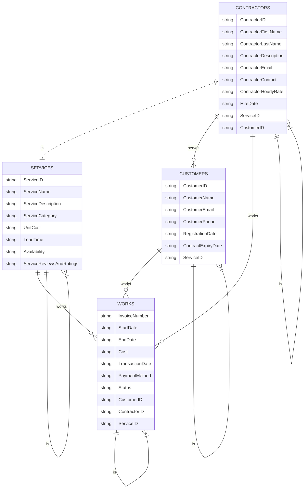

# Demo PROJECT ERD

create a ERD using mermaid base on these tables primary keys(PK) and foreign keys(FK):
Contractors 

Contractor ID (PK) 

Contractor First Name 

Contractor Last Name 

Contractor Description 

Contractor Email 

Contractor Contact 

Contractor Hourly Rate 

Hire Date 

Service ID (FK) 

Customer ID (FK) 

 

Customers  

Customer ID (PK) 

Customer Name 

Customer Email 

Customer Phone 

Registration Date 

Contract Expiry Date 

Service ID (FK) 

Services 

Service ID (PK) 

Service Name 

Service Description 

Service category 

Unit Cost 

Lead time (time required for delivery or completion of the service) 

Availability 

Service reviews and ratings 

Contractor ID (FK) – Since this is only a list of services, we don’t need to add FK to this table. 

Customer ID (FK) – Since this is only a list of services, we don’t need to add FK to this table. 

 

Works 

Invoice Number (PK) 

Start date 

End date 

Cost 

Transaction Date 

Payment Method 

Status  (pending, in progress, completed, cancelled) 

Customer ID (FK) 

Contractor ID (FK) 

Service ID (FK)

