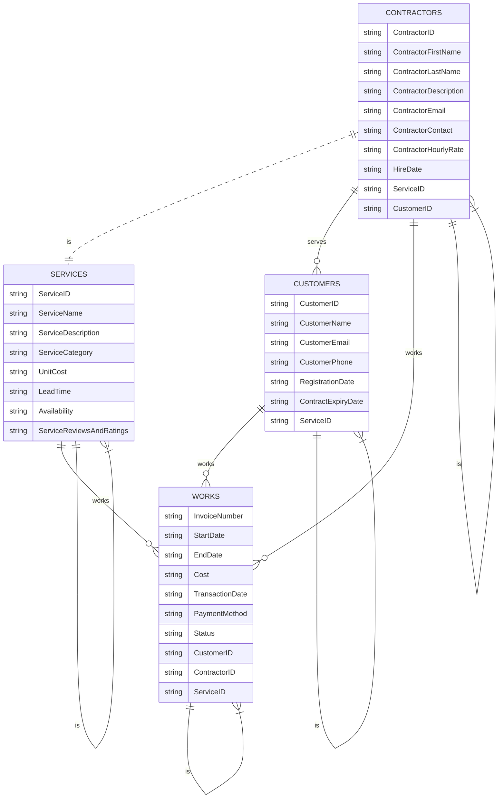

# Demo PROJECT ERD

# The Data Model

A data model is a plan or blueprint for a database design.​

A data model is more generalized and abstract than a database design.​

It is easier to change a data model than it is to change a database design, so it is the appropriate place to work through conceptual database problems.

## E-R Model

Entity-Relationship model is a set of concepts and graphical symbols that can be used to create conceptual schemas.​

Versions:​ 
- Original E-R model—by Peter Chen (1976)​ 
- Extended E-R model—extensions to the Chen model​ 
- Information Engineering (IE)—by James Martin (1990); uses “crow’s foot” notation, is easier to understand.​ 
- IDEF1X—a national standard developed by the National Institute of Standards and Technology ​ 
- Unified Modeling Language (UML)—by the Object Management Group; it supports object-oriented methodology

## Entities

Something that can be identified and the users want to track:​
- Entity class—a collection of entities of a given type​
- Entity instance—the occurrence of a particular entity​

There are usually many instances of an entity in an entity class.

CUSTOMER:​

The Entity Class and Two Entity Instances

## Attributes

Attributes describe an entity’s characteristics.​

All entity instances of a given entity class have the same attributes, but vary in the values of those attributes.​

Originally shown in data models as ellipses.​

Data modeling products today commonly show attributes in rectangular form.

EMPLOYEE:​

Attributes in Ellipses

Attributes in Entity Rectangle

## Identifiers

Identifiers are attributes that name, or identify, entity instances.​

The identifier of an entity instance consists of one or more of the entity’s attributes.​

Composite identifiers are identifiers that consist of two or more attributes.​

Identifiers in data models become keys in database designs.​

Entities have identifiers.​

Tables (or relations) have keys.

Entity Attribute Display​ in Data Models:

## Relationships

Entities can be associated with one another in relationships:​
- Relationship classes: associations among entity classes​
- Relationship instances: associations among entity instances​

In the original E-R model, relationships could have attributes, but today this is no longer done.​

A relationship class can involve two or more entity classes.

### Degree of the Relationship

The degree of the relationship is the number of entity classes in the relationship:​
- Two entities have a binary relationship of degree two.​
- Three entities have a ternary relationship of degree three.

Binary Relationship​:

Ternary Relationship​:

Entities and Tables:
- The principle difference between an entity and a table (relation) is that you can express a relationship between entities without using foreign keys.​
- This makes it easier to work with entities in the early design process where the very existence of entities and the relationships between them is uncertain.

## Cardinality

Cardinality means “count,” and is expressed as a number.​
- Maximum cardinality is the maximum number of entity instances that can participate in a relationship.​
- Minimum cardinality is the minimum number of entity instances that must participate in a relationship.

### Maximum Cardinality

Maximum cardinality is the maximum number of entity instances that can participate in a relationship.​

There are three types of maximum cardinality:​
-One-to-One [1:1]​
-One-to-Many [1:N]​
-Many-to-Many [N:M]