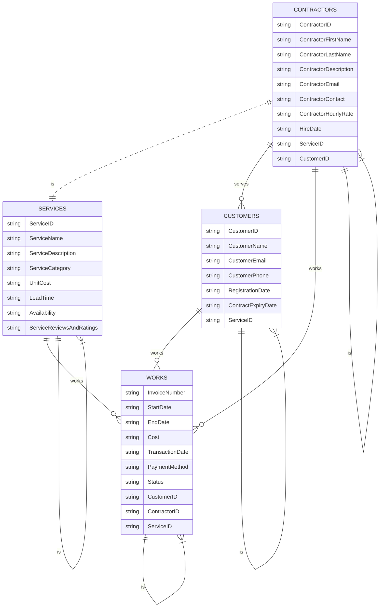
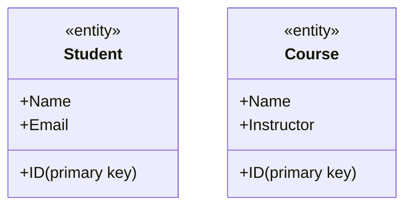
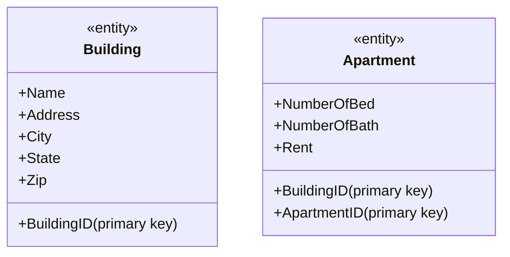

# Demo PROJECT ERD

# The Data Model

A data model is a plan or blueprint for a database design.​

A data model is more generalized and abstract than a database design.​

It is easier to change a data model than it is to change a database design, so it is the appropriate place to work through conceptual database problems.

## E-R Model

Entity-Relationship model is a set of concepts and graphical symbols that can be used to create conceptual schemas.​

Versions:​ 
- Original E-R model—by Peter Chen (1976)​ 
- Extended E-R model—extensions to the Chen model​ 
- Information Engineering (IE)—by James Martin (1990); uses “crow’s foot” notation, is easier to understand.​ 
- IDEF1X—a national standard developed by the National Institute of Standards and Technology ​ 
- Unified Modeling Language (UML)—by the Object Management Group; it supports object-oriented methodology

## Entities

Something that can be identified and the users want to track:​
- Entity class—a collection of entities of a given type​
- Entity instance—the occurrence of a particular entity​

There are usually many instances of an entity in an entity class.

CUSTOMER:​

The Entity Class and Two Entity Instances

## Attributes

Attributes describe an entity’s characteristics.​

All entity instances of a given entity class have the same attributes, but vary in the values of those attributes.​

Originally shown in data models as ellipses.​

Data modeling products today commonly show attributes in rectangular form.

EMPLOYEE:​

Attributes in Ellipses

Attributes in Entity Rectangle

## Identifiers

Identifiers are attributes that name, or identify, entity instances.​

The identifier of an entity instance consists of one or more of the entity’s attributes.​

Composite identifiers are identifiers that consist of two or more attributes.​

Identifiers in data models become keys in database designs.​

Entities have identifiers.​

Tables (or relations) have keys.

Entity Attribute Display​ in Data Models:

## Relationships

Entities can be associated with one another in relationships:​
- Relationship classes: associations among entity classes​
- Relationship instances: associations among entity instances​

In the original E-R model, relationships could have attributes, but today this is no longer done.​

A relationship class can involve two or more entity classes.

### Degree of the Relationship

The degree of the relationship is the number of entity classes in the relationship:​
- Two entities have a binary relationship of degree two.​
- Three entities have a ternary relationship of degree three.

Binary Relationship​:

Ternary Relationship​:

Entities and Tables:
- The principle difference between an entity and a table (relation) is that you can express a relationship between entities without using foreign keys.​
- This makes it easier to work with entities in the early design process where the very existence of entities and the relationships between them is uncertain.

## Cardinality

Cardinality means “count,” and is expressed as a number.​
- Maximum cardinality is the maximum number of entity instances that can participate in a relationship.​
- Minimum cardinality is the minimum number of entity instances that must participate in a relationship.

### Maximum Cardinality

Maximum cardinality is the maximum number of entity instances that can participate in a relationship.​

There are three types of maximum cardinality:​
- One-to-One [1:1]​
- One-to-Many [1:N]​
- Many-to-Many [N:M]

Crows Foot notation:

#### Parent and Child Entities​:

In a one-to-many relationship:​
- The entity on the one side of the relationship is called the parent entity or just the parent.​
- The entity on the many side of the relationship is called the child entity or just the child.​

In the figure above, USER is the parent and VIDEO is the child

#### HAS-A Relationships​:

The relationships we have been discussing are known as HAS-A relationships:​

Each entity instance has a relationship with another entity instance.​
- A USER has rented one or more VIDEOS.​
- A VIDEO has one borrowed USER.

### Minimum Cardinality​

Minimum cardinality is the minimum number of entity instances that must participate in a relationship.​

Minimums are generally stated as either zero or one:​
- IF zero [0] THEN participation in the relationship by the entity is optional, and no entity instance must participate in the relationship.​
- IF one [1] THEN participation in the relationship by the entity is mandatory, and at least one entity instance must participate in the relationship

Crows Foot notation:

#### Indicating Minimum Cardinality​:

As shown in the examples in a following [image](####Crows Foot Notation​ for Minimum Cardinality​:)
- Minimum cardinality of zero [0] indicating optional participation is indicated by placing an oval ssnext to the optional entity.​
- Minimum cardinality of one [1] indicating mandatory (required) participation is indicated by placing a vertical hash mark next to the required entity.

#### Reading Minimum Cardinality​:

Look toward the entity in question:​
- IF you see an oval THEN that entity is optional (minimum cardinality of zero [0]).​
- IF you see a vertical hash mark THEN that entity is mandatory (required) (minimum cardinality of one [ 1]).

#### Crows Foot Notation​ for Minimum Cardinality​:

## Data Modeling Notation:​ IE Crow’s Foot

### IE Crow’s Foot 1:N

### IE Crow’s Foot N:M

# Examples

## Example 1

I want a course registratio database. Store information about my students, including their IDs, names, and emails. A course should have information about course ID, course name, and instructor name.
- How many entities do you need?​
    - Student​
    - Course​
- Draw a diagram for each entity.

## Example 2

I am a the manager for apartment rental office. I want a database to maintain all my apartments. Each apartment building will have a building name, address, city, state, and zip code. A building has many apartments. An apartment has a apartment number, number of bedrooms, number of bathrooms, and rent cost.
- How many entities do you need?​
    - Building​
    - Apartment​
- Draw a diagram for each entity.

## ID-Dependent Entities​

An ID-dependent entity is an entity (child) whose identifier includes the identifier of another entity (parent).​

The ID-dependent entity is a logical extension or subunit of the parent:​
- BUILDING : APARTMENT​
- PAINTING : PRINT​

The minimum cardinality from the ID-dependent entity to the parent is always one.

## Weak Entities​

A weak entity is an entity whose existence depends upon another entity.​

All ID-Dependent entities are considered weak.​

There are also non-ID-dependent weak entities.​
- The identifier of the parent does not appear in the identifier of the weak child entity.

# IE Crow’s Foot Symbol Summary I

# Strong Entity Patterns

## 1:1 Strong Entity Relationships

## 1:N Strong Entity Relationships

## N:M Strong Entity Relationships

# ID-Dependent Relationships

## The Association Pattern

## The Multivalued Attribute Pattern

## Composite Multivalued Attributes

## The Archetype/Instance Pattern

The archetype/instance pattern occurs when the ID-dependent child entity is the physical manifestation (instance) of an abstract or logical parent.​
- PAINTING : PRINT​
- CLASS : SECTION​
- YACHT_DESIGN : YACHT​
- HOUSE_MODEL: HOUSE

