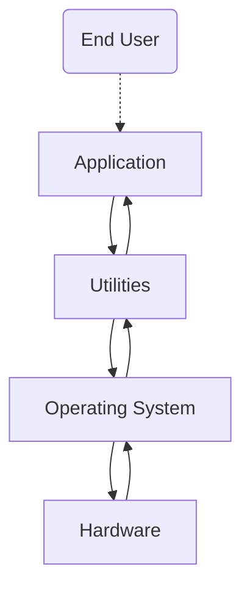

# Part 1: OS definition, objectives and functions

Definition is "What it is", Objectives are "What it aims to do", and Functions are "What it does".

## Definition

- Operating system is a software that controls the execution of application programs, its an interface between the application and hardware(computer system).
- The applicatin programs do not have direct access to the hardware, they must use the OS to access the hardware.

## Objectives

#### Convenience

Makes the computer easier to use by acting as an interface between the user and the computer hardware.

Here how a computer is layered:

Utilities are set of system programs that help in program creation, managing files and controlling io devices.

- OS services:
    - Program development
    - Program execution
    - Access to I/O devices
    - Acounting
    - Error detection and response
    - Controlled Access to files
    - System Access

#### Efficiency

Uses the computer system resources in an efficient manner. like CPU, memory, I/O devices, etc.

OS functions just like any other software, the difference is that:
- Directs the processor in the use of other resources.
- Schedules the timing of programs or processes.

#### Ability to Evolve

Enables development, testing, and use of new software and hardware without disrupting the system. for example, if you connect a keyboard to the computer, the OS should be able to recognize it and use it.

OS evolve overtime because there are always new hardware and software that need to be supported, and New services that need to be added and flaws that need to be fixed. this constant nedd for change sets a certine requirement for the OS implementation.To meet this requirement, operating systems need to be designed in a way that allows for flexibility and adaptability. One approach to achieving this is by __making the operating system modular in its construction.__

When an operating system is modular in its construction, it means that it is __designed to be composed of individual, interchangeable components or "modules" that can be easily added, removed, or replaced without affecting the rest of the system.__ This allows for flexibility and ease of maintenance, as well as the ability to update or upgrade specific parts of the system without having to overhaul the entire system.

For an operating system to be modular, it is important to __have clear defined interfaces between modules.__ The interfaces are the points where different modules interact with each other. These interfaces need to be well-defined and documented, so that developers can understand how to interact with them and how to use them to add new features or functionalities to the system.

__Well-documented__ interfaces are also important for maintainability, as it allows developers to understand how different parts of the system interact with each other and how to troubleshoot issues that may arise. This documentation can also provide instructions and guidelines for developers who want to create new modules or make changes to existing ones.

Overall, a modular design enables the creation of a more robust, adaptable, and scalable system, allowing it to meet the constant need for change in technology and user requirements.

# Part 2: Evolution of the OS

## Serial Processing

- back in the day computers had no OS, programmers interacted directly with the hardware.
- computers had a console with display lights, switches, some input devices and a printer.
- If an error halted the program, the error condition was indicated by the lights.
- the users had to use the computer in series, meaning that they had to wait for the computer to finish the current task before they can start another task. 
- one task at a time.

#### Problems

1. Scheduling
    - physical sign up sheets where used to reserve computer time.
    - if a task takes longer than time reserved for it, its wasting the time of the computer.
2. Setup time
    - a certain amount of time is set just to setup the computer for the program to run, this took longer than the program itself. like damn bruh.
## Simple Batch Processing

These computers were very expensive, so it was important to make sure that the processor was being used as efficiently as possible. Therefore the concept of a batch OS was developed.

The central idea behind the simple batch-processing scheme is the use of a piece of software known as the Monitor:
- user no longer had direct access to processor
- A computer operator(a middle man) recives the job from the user, batches it and and place them on an input device.
- program branches back to the monitor when finished

Monitor POV:
- controls sequence of jobs
- "Residen" Monitor is a software that runs in the memory
- monitor reads in job and the current job is placed in the user program area, and control is passed to this job.
- job returns control to monitor when finished, which immediately reads in the next job.

layout of the monitor:
---

---
When a job (a task or program) is submitted to the computer, the monitor reads it in and gives control to the job. Once the job is finished, it returns control back to the monitor. The monitor then manages the next step in the process, such as reading in the next job or returning the output to the user. The resident monitor is a specific type of monitor that is always present in the computer's memory, as opposed to being loaded from an external source.

Processor POV:
- it executes instructions from memory containing the monitor unitil it encounters an ending/error condition.
- Job Control Language (JCL), Special type of programming language used to provide instructions to the monitor.

the instructions that are executed from the portion of memory containing the monitor cause the next job to be read in and placed in the user program area. Once a job has been read in, the processor will encounter a branch instruction in the monitor that instructs the processor to continue execution at the start of the user program. The processor will then execute the instructions in the user program until it encounters an ending or error condition. Either event causes the processor to fetch its next instruction from the monitor program. Thus the phrase “control is passed to a job” simply means the processor is now fetching and executing instructions in a user program, and “control is returned to the monitor” means the processor is now fetching and executing instructions from the monitor program.

Hardware features:
- Memory Protection for monitor, the user program does not alter the monitor.
- Timer, prevent a job from monopolizing/ hogging the system.
- Privileged Instructions, instructions that can only be executed by the monitor.
- interrupt, gives OS more flerixibility.

Modes of operation:
User Mode | Kernel Mode
---------|----------
user program executes in user mode | monitor executes in kernel mode
certain areas of memory are protected from user access | privileged instructions may be executed
certain instructions may not be executed | protected areas of memory may be accessed

these two modes of operation are to fulfill the "Memory Protection" and "Privileged Instructions" features, User mode is for protecting certain areas of memory from user access, and kernel mode is for executing privileged instructions that have access to protected areas of memory. In other words, user mode is for user programs to execute in a restricted environment, while kernel mode is for the operating system and system level tasks to have full access to the system resources.

#### Problems

1. Processor time alternates between user program and monitor execution.
2. The sacrifices:
    - some main memory is used for the monitor
    - some processor time is used for monitor execution

## Multiprogrammed Batch Systems

Even with automatic job sequencing the processor is often idle(meaning it has nothing to do) because IO devices are slow compared to the processor. this is the case in uniprogramming systems, because the processor is only executing one job at a time. the solution is to have multiple jobs in memory at the same time, and to switch between them. this is called multiprogramming.

Multiprogramming: A mode of operation that provides for the interleaved execution of two or more computer programs by a single processor. The same as multitasking, using different terminology.
- Memory is expanded to hold more than one program and switch between them.
- central theme for modern OS.

#### Problems

1. Requires memory managment because to have several jobs ready to run, they need to be in memory.
2. Requires Scheduling algorithms to decide which job to run next.

## Time Sharing Systems

Although multiple batch programming was efficient, it is still desirable to have a system where the __user can interact directly__ with the computer. This is called time sharing, where the processor time is shared by many users at the same time. The computer is divided into time slices, and each user gets a time slice to use the computer.

In a time-sharing system, multiple users simultaneously access the system through terminals, with the OS interleaving the execution of each user program in a short burst or quantum of computation.

Both batch processing and time sharing use multiprogramming.

|        | Batch Multiprogramming | Time Sharing
|--------|-----------------------|-------------
Principal objective | Maximize processor use | Minimize response time
Source of directives to operating system | Job control language commands provided with the job | Commands entered

### Compatible Time-Sharing Systems (CTSS)

One of the first time-sharing operating systems to be developed

Time slicing:
A system clock generated interrupts at a rate of approximately one every 0.2 seconds. At each clock interrupt, the OS regained control and could assign the processor to another user. This technique is known as time slicing. Thus, at regular time intervals, the current user would be preempted and another user loaded in. To preserve the old user program status for later resumption, the old user programs and data were written out to disk before the new user programs and data were read in. Subsequently, the old user program code and data were restored in main memory when that program was next given a turn.

To minimize disk traffic, user memory was only written out when the incoming program would overwrite it. illiustration below:

#### Problems

1. jobs must be protected from interference with each other in memory.
2. making sure only authorized users have access to a particular file since there are multiple users.
3. The contention for resources, such as printers and mass storage devices, must be handled.

# Part 3: Major achievements

Major advances in developmen include:
1. Processes
2. Memory Management
3. Information protection and security
4. Scheduling and resource management
5. System structure

Each advance is characterized by principles, or abstractions, developed to meet difficult practical problems. Taken together, these five areas span many of the key design and implementation issues of modern operating systems.

### Processes

A process can be defined as:
- a program in execution
- an instance of a running program
- the entity that can be assigned to, and executed on, a processor
- a unit of activity characterized by a single sequential thread of execution, a current state, and an associated set of system resources

The Proces was developed because of problems people encoutered, there are three major lines of computer system development that created problems in timing and synchronization which contributed to its advancement, that are:
1. Multiprogramming - Processor and I/O devices is busy to achieve maximum efficiency, is switched among the various programs residing in main memory
2. Time sharing - be responsive to the individual user but be able to support many users at the same time
3. Real-time transaction systems - a number of users are entering queries or updates against a database, and the system must respond to each user in a timely manner.

The principal tool available to system programmers in developing the early multiprogramming and multiuser interactive systems was the interrupt. The activity of any job could be suspended by the occurrence of a defined event, such as an I/O completion. The processor would save some sort of context (e.g., program counter and other registers) and branch to an interrupt-handling routine which would determine the nature of the interrupt, process the interrupt, then resume user processing with the interrupted job or some other job.
The design of the system software to coordinate these various activities turned out to be remarkably difficult. With many jobs in progress at any one time, each of which involved numerous steps to be performed in sequence, it became impossible to analyze all of the possible combinations of sequences of events. In the absence of some systematic means of coordination and cooperation among activities, programmers resorted to ad hoc methods based on their understanding of the environment that the OS had to control. These efforts were vulnerable to subtle programming errors whose effects could be observed only when certain relatively rare sequences of actions occurred. These errors were difficult to diagnose, because they needed to be distinguished from application software errors and hardware errors. Even when the error was detected, it was difficult to determine the cause, because the precise conditions under which the errors appeared were very hard to reproduce. In general terms, the four main causes of such errors were:
- Improper synchronization - a program must wait until the data are available in a buffer
- Failed mutual exclusion - more than one user or program tries to make use of a shared resource at the same time
- Nondeterminate program operation - program execution is interleaved by the processor when memory is shared
- Deadlock - two or more programs waiting for each other to finish

To overcome these problems a  systimatic way to monitor and control the activities of the system was needed. Introducing the concept of PROCESS

Components of a Process:
- an executable program (whata re my directives)
- the associated data needed by the program (what am i working on)
- the exection context (what is my progress), The execution context (or process state), is the internal data by which the OS is able to supervise and control the process. This internal information is separated from the process, because the OS has information not permitted to the process. The context includes all of the information the OS needs to manage the process, and the processor needs to execute the process properly. The context includes the contents of the various processor registers, such as the program counter and data registers. It also includes information of use to the OS, such as the priority of the process and whether the process is waiting for the completion of a particular I/O event.

Process Management:
1. two process exist in portion of main memory

2. A block of memory is allocated to each process that contains:
    - the program code
    - the program data
    - the execution context

3. ech process is recorded in a process list built and maintained by the OS

4. The list contains one entry of each process, which includes a pointer to the block of memory that contains the process.

5. The entry may also include part or all of the execution context.

6. the process index register contains the index into the process list of the process currently executing(controlling the processor).

7. the program counter(PC) points to the next instruction to be executed in the process.

8. the base and limit define the region in memory that contains the process. the base register hold the starting address of the region of memory, the limit is the size of the region.

9. the PC and all data refrences are interupted relative to the base register and must not exceed the value in limit. this to prevent interprocess interference.]

10. the content of the program that was temporarlly interrupted is recorded in its execution context. later, the OS can preform a process switch to resume the process.

### Memory Management

The five principal storage management responsibilities of the OS are:

- Process isolation - OS must prevent one process from interfering with another process memory
- Automatic allocation and managment - programs should be dinamically allocated across the memory hierarchy as required. allocation should be straightforward to the programmer.
- Support of modular programming - programmers should be able to define program modules, and create, destroy, and alter the size of modules dynamically.
- Protection and access control - OS must provide differnet ways to access memory by various users.
- Long-term storage management - Many applications programs require means for storing information for extended periods of time, after the computer has been powered down, OS must provide a mechanism to store and retrieve data from secondary storage.

### Information protection and security

Main Issues: availability, integrity, and confidentiality and authenticity

- Availability - protecting the system against interruption
- Confidentiality - access only for authorized users
- Integrity - preventing unauthorized modification of data
- Authenticity - proper verification of the identity of users and the validity of data

### Scheduling and resource management

Key responsibility of an OS is managing resources, resource allocation policies must consider:

- Efficiency - maximize throughput, minimize response time, accommodate as many users as possible
- Fairness - processes are to be given equal and fair access to resources
- Differential responsiveness - the OS may need to discriminate among different classes of jobs with different service requirements

### System structure

The OS can be viewed as a series of levels due to its enormous complecity. Each level:
- preforms a  related subset of functions
- relies on next lower level to preform more primitive functions

Well defined interface, meaning one level can be modified without affecting the other levels. this decomposes a problem into a number of more manageable subproblems.

# Part 4: Characteristic of modern OS

These modern operating systems respond to new developments in hardware, new applications, and new security threats. Among the key hardware drivers are multiprocessor systems, greatly increased processor speed, high-speed network attachments, and increasing size and variety of memory storage devices. In the application arena, multimedia applications, Internet and Web access, and client/server computing have influenced OS design.

Different Architectural Approaches for OS:
1. Microkernel architecture
2. Multithreading
3. Symmetric multiprocessing
4. Distributed operating systems
5. Object-oriented design

### Microkernel architecture

OS kernel is a software
- its the central module of the OS
- part of the OS that is loaded first and remains in main memory
- contains all the essential services required by other parts of the OS & apps
- its loaded into a protected are of main memory to prevent being overwritten by other programs
- responsiblities:
    - memory management
    - process and task management
    - disk management
- it connects the system hardware to the application software

Monolithic: Until recently, most operating systems featured a large Monolithic kernel, A large kernel containing virtually the complete operating system, including scheduling, file system, device drivers, and memory management. All the functional components of the kernel have access to all of its internal data structures and routines. Typically, a monolithic kernel is implemented as a single process, with all elements sharing the same address space.

Microkernel: A small, privileged operating system core that provides process scheduling, memory management, and communication services and relies on other processes(sometimes called servers) to perform some of the functions traditionally associated with the operating system kernel(These processes run in user mode). This approach decouples kernel and server development. Servers may be customized to specific application or environment requirements. The microkernel approach:
- simplifies implementation
- provides flexibility
- and is well suited to a distributed environment.

### Multithreading

Teachnique in which a process, executing an application is divided into threads that can run concurrently(meaning at the same time).

Process || Thread
-----------------|-----------------
- a collection of one or more threads and associated system resources | - dispatchable unit of work
- programmer has greater control over the modularity of the application and the timing of application related events | - includes a processor context and its own data area to enable subroutine branching
- executes sequentially and is interruptible | - executes sequentially and is interruptible

### Symmetric multiprocessing (SMP)

Term that refers to a computer hardware architecture and also to the OS behavior that exploits that architecture

- several processes can run in parallel
- multiple processors are transparent to the user, the share same main memory and i/o devices and they can preform the same operations
- the OS does the scheduling of threads or processes on individual processors and synchronizations among processors

Advantages of SMP:
- performance, more than one process can be running simultaneously, each on a different processor
- availability, failure of a single processor does not halt the system
- incremental growth, performance of a system can be enhanced by adding an additional processor
- scaling, vendors can offer a range of products based on the number of processors configured in the system

### Distributed OS

Sodtware over a network of physically separate computers.

Provides the illusion of
-  a single main memory space
- single secondary storage space
- unified access facilities
but in reality, the OS is distributed over a network of computers.

### Object-oriented design

- for adding modular extensions to a small kernel
- allows programmers to customize the OS without disrupting the system integrity
- eases the development of new OS features

