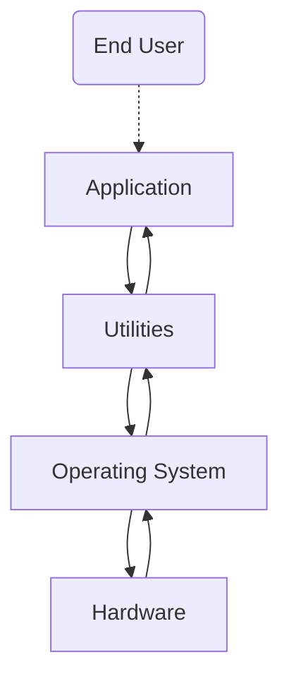

# Part 1: OS definition, objectives and functions

Definition is "What it is", Objectives are "What it aims to do", and Functions are "What it does".

## Definition

- Operating system is a software that controlos the execution of application programs, its an interface between the application and hardware(computer system).
- The applicatin programs do not have direct access to the hardware, they must use the OS to access the hardware.

## Objectives

#### Convenience

Makes the computer easier to use by acting as an interface between the user and the computer hardware.

Here how a computer is layered:

Utilities are set of system programs that help i program creation, managing files and controlling io devices.

- OS services:
    - Program development
    - Program execution
    - Access to I/O devices
    - Acounting
    - Error detection and response
    - Controlled Access to files
    - System Access

#### Efficiency

Uses the computer system resources in an efficient manner. like CPU, memory, I/O devices, etc.

OS functions just like any other software, the difference is that:
- Directs the processor in the use of other resources.
- Schedules the timing of programs or processes.

#### Ability to Evolve

Enables development, testing, and use of new software and hardware without disrupting the system. for example, if you connect a keyboard to the computer, the OS should be able to recognize it and use it.

OS evolve overtime because there are always new hardware and software that need to be supported, and New services that need to be added and flaws that need to be fixed. this constant nedd for change sets a certine requirement for the OS implementation.To meet this requirement, operating systems need to be designed in a way that allows for flexibility and adaptability. One approach to achieving this is by __making the operating system modular in its construction.__

When an operating system is modular in its construction, it means that it is __designed to be composed of individual, interchangeable components or "modules" that can be easily added, removed, or replaced without affecting the rest of the system.__ This allows for flexibility and ease of maintenance, as well as the ability to update or upgrade specific parts of the system without having to overhaul the entire system.

For an operating system to be modular, it is important to __have clear defined interfaces between modules.__ The interfaces are the points where different modules interact with each other. These interfaces need to be well-defined and documented, so that developers can understand how to interact with them and how to use them to add new features or functionalities to the system.

__Well-documented__ interfaces are also important for maintainability, as it allows developers to understand how different parts of the system interact with each other and how to troubleshoot issues that may arise. This documentation can also provide instructions and guidelines for developers who want to create new modules or make changes to existing ones.

Overall, a modular design enables the creation of a more robust, adaptable, and scalable system, allowing it to meet the constant need for change in technology and user requirements.

# Part 2: Evolution of the OS

## Serial Processing

- back in the day computers had no OS, programmers interacted directly with the hardware.
- computers had a console with display lights, switches, some input devices and a printer.
- If an error halted the program, the error condition was indicated by the lights.
- the users had to use the computer in series, meaning that they had to wait for the computer to finish the current task before they can start another task. 
- one task at a time.

#### Problems

1. Scheduling
    - physical sign up sheets where used to reserve computer time.
    - if a task takes longer than time reserved for it, its wasting the time of the computer.
2. Setup time
    - a certain amount of time is set just to setup the computer for the program to run, this took longer than the program itself. like damn bruh.
## Simple Batch Processing

These computers were very expensive, so it was important to make sure that the processor was being used as efficiently as possible. Therefore the concept of a batch OS was developed.

The central idea behind the simple batch-processing scheme is the use of a piece of software known as the Monitor:
- user no longer had direct access to processor
- A computer operator(a middle man) recives the job from the user, batches it and and place them on an input device.
- program branches back to the monitor when finished

Monitor POV:
- controls sequence of jobs
- "Residen" Monitor is a software that runs in the memory
- monitor reads in job and the current job is placed in the user program area, and control is passed to this job.
- job returns control to monitor when finished, which immediately reads in the next job.

layout of the monitor:
---

---
When a job (a task or program) is submitted to the computer, the monitor reads it in and gives control to the job. Once the job is finished, it returns control back to the monitor. The monitor then manages the next step in the process, such as reading in the next job or returning the output to the user. The resident monitor is a specific type of monitor that is always present in the computer's memory, as opposed to being loaded from an external source.

Processor POV:
- it executes instructions from memory containing the monitor unitil it encounters an ending/error condition.
- Job Control Language (JCL), Special type of programming language used to provide instructions to the monitor.

the instructions that are executed from the portion of memory containing the monitor cause the next job to be read in and placed in the user program area. Once a job has been read in, the processor will encounter a branch instruction in the monitor that instructs the processor to continue execution at the start of the user program. The processor will then execute the instructions in the user program until it encounters an ending or error condition. Either event causes the processor to fetch its next instruction from the monitor program. Thus the phrase “control is passed to a job” simply means the processor is now fetching and executing instructions in a user program, and “control is returned to the monitor” means the processor is now fetching and executing instructions from the monitor program.

Hardware features:
- Memory Protection for monitor, the user program does not alter the monitor.
- Timer, prevent a job from monopolizing/ hogging the system.
- Privileged Instructions, instructions that can only be executed by the monitor.
- interrupt, gives OS more flerixibility.

Modes of operation:
User Mode | Kernel Mode
---------|----------
user program executes in user mode | monitor executes in kernel mode
certain areas of memory are protected from user access | privileged instructions may be executed
certain instructions may not be executed | protected areas of memory may be accessed

these two modes of operation are to fulfill the "Memory Protection" and "Privileged Instructions" features, User mode is for protecting certain areas of memory from user access, and kernel mode is for executing privileged instructions that have access to protected areas of memory. In other words, user mode is for user programs to execute in a restricted environment, while kernel mode is for the operating system and system level tasks to have full access to the system resources.

#### Problems

1. Processor time alternates between user program and monitor execution.
2. The sacrifices:
    - some main memory is used for the monitor
    - some processor time is used for monitor execution

## Multiprogrammed Batch Systems

even with automatic job sequencing the processor is often idle(meaning it has nothing to do) because IO devices are slow compared to the processor. this is the case in uniprogramming systems, because the processor is only executing one job at a time. the solution is to have multiple jobs in memory at the same time, and to switch between them. this is called multiprogramming.

Multiprogramming: A mode of operation that provides for the interleaved execution of two or more computer programs by a single processor. The same as multitasking, using different terminology.
- Memory is expanded to hold more than one program and switch between them.
- central theme for modern OS.

#### Problems

1. Requires memory managment because to have several jobs ready to run, they need to be in memory.
2. Requires Scheduling algorithms to decide which job to run next.

## Time Sharing Systems

# Part 3: Major achievements

# Part 4: Characteristic of modern OS 