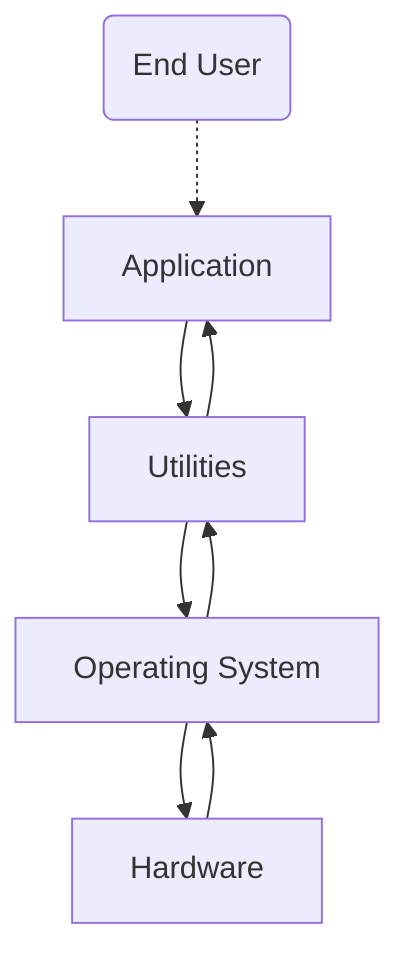
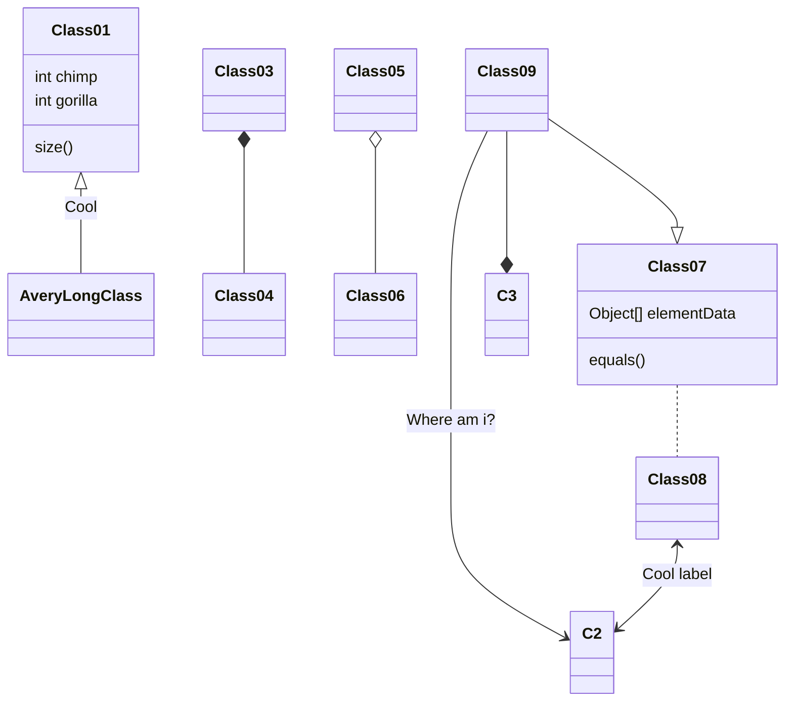

# Part 1: OS definition, objectives and functions

Definition is "What it is", Objectives are "What it aims to do", and Functions are "What it does".

## Definition

- Operating system is a software that controlos the execution of application programs, its an interface between the application and hardware(computer system).
- The applicatin programs do not have direct access to the hardware, they must use the OS to access the hardware.

## Objectives

#### Convenience

Makes the computer easier to use by acting as an interface between the user and the computer hardware.

Here how a computer is layered:

Utilities are set of system programs that help i program creation, managing files and controlling io devices.

- OS services:
    - Program development
    - Program execution
    - Access to I/O devices
    - Acounting
    - Error detection and response
    - Controlled Access to files
    - System Access

#### Efficiency

Uses the computer system resources in an efficient manner. like CPU, memory, I/O devices, etc.

OS functions just like any other software, the difference is that:
- Directs the processor in the use of other resources.
- Schedules the timing of programs or processes.

#### Ability to Evolve

Enables development, testing, and use of new software and hardware without disrupting the system. for example, if you connect a keyboard to the computer, the OS should be able to recognize it and use it.

OS evolve overtime because there are always new hardware and software that need to be supported, and New services that need to be added and flaws that need to be fixed. this constant nedd for change sets a certine requirement for the OS implementation.To meet this requirement, operating systems need to be designed in a way that allows for flexibility and adaptability. One approach to achieving this is by __making the operating system modular in its construction.__

When an operating system is modular in its construction, it means that it is __designed to be composed of individual, interchangeable components or "modules" that can be easily added, removed, or replaced without affecting the rest of the system.__ This allows for flexibility and ease of maintenance, as well as the ability to update or upgrade specific parts of the system without having to overhaul the entire system.

For an operating system to be modular, it is important to __have clear defined interfaces between modules.__ The interfaces are the points where different modules interact with each other. These interfaces need to be well-defined and documented, so that developers can understand how to interact with them and how to use them to add new features or functionalities to the system.

__Well-documented__ interfaces are also important for maintainability, as it allows developers to understand how different parts of the system interact with each other and how to troubleshoot issues that may arise. This documentation can also provide instructions and guidelines for developers who want to create new modules or make changes to existing ones.

Overall, a modular design enables the creation of a more robust, adaptable, and scalable system, allowing it to meet the constant need for change in technology and user requirements.

# Part 2: Evolution of the OS

## Serial Processing

- back in the day computers had no OS, programmers interacted directly with the hardware.
- computers had a console with display lights, switches, some input devices and a printer.
- the users had to use the computer in series, meaning that they had to wait for the computer to finish the current task before they can start another task. 
- one task at a time.

#### Problems

1. Scheduling
    - physical sign up sheets where used to reserve computer time.
    - if a task takes longer than time reserved for it, its wasting the time of the computer.
2. Setup time
    - a certain amount of time is set just to setup the computer for the program to run, this took longer than the program itself. like damn bruh.
## Simple Batch Processing

These computers were very expensive, so it was important to make sure that the processor was being used as efficiently as possible. Therefore the use of a software call Monitor was introduced.

- user no longer had direct access to processor
- A computer operator(a middle man) recives the job from the user batches it and and place them on an input device.
- program branches back to the monitor when finished

Monitor POV:
- controls sequence of jobs
- "Residen" Monitor: runs in the main memory
- reads in job and gives control
- job returns control to monitor when finished

## Multiprogrammed Batch Systems

## Time Sharing Systems

# Part 3: Major achievements

# Part 4: Characteristic of modern OS 