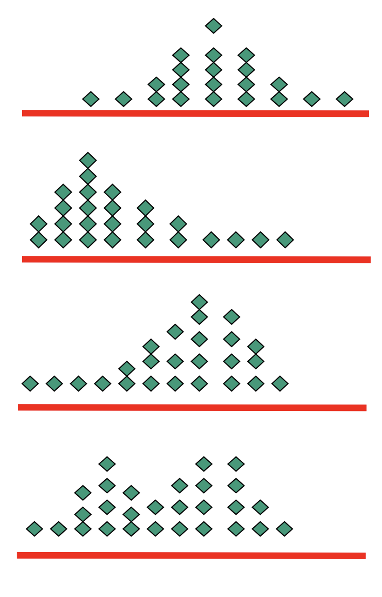

Sure, here are the organized notes using Markdown:

## What & Why Statistics?
- Almost every day you are exposed to statistics, e.g.:
    - The number of Americans with diabetes will nearly double in the next 25 years. (Source: Diabetes Care)
    - The NRF expects holiday sales to decline 1% versus a 3.4% drop in holiday sales the previous year. (Source: National Retail Federation)
    - EIA projects total U.S. natural gas consumption will decline by 2.6 percent in 2009 and increase by 0.5 percent in 2010. (Source: Energy Information Administration)
- Statistics refers to:
    - Numerical facts
    - The field of study
    - A tool in making decisions
        - Research Objective
        - Research Hypotheses
    - A process to:
        - Collect
        - Analyze
        - Present
        - Interpret
        - Data
    - Make informed decisions

- Statistics is the science of collecting, organizing, analyzing, and interpreting data in order to make decisions.

## Role of Statistics
- **Statistical Tools**: A collection of tools and techniques that are used to convert data into meaningful information.

## Type of Statistics
- Depends on:
    1. Purpose
        - Descriptive
        - Inferential
    2. Assumption on Normality
        - Parametric
        - Nonparametric
    3. Number of Variables
        - Univariate
        - Bivariate
        - Multivariate

## Variables
- A variable is a characteristic that may change under different circumstances.
- Examples:
    - Hair color – varies between individuals
    - White blood cell count – varies between individuals
    - Class schedule – varies between courses
    - Time to failure of a computer component – varies between different computers
    - Transmission error rate – varies between different types of transmission cables, length of cable segment

## Type of Variable
- Two Types:
    - **Qualitative variables**: Measure a quality or characteristic on each experimental unit. (categorical data)
    - **Quantitative variables**: Measure a numerical quantity or amount on each experimental unit.

### Qualitative variables (what, which type…)
- Measure a quality or characteristic on each experimental unit. (categorical data)
- Examples:
    - Hair color (black, brown, blonde…)
    - Make of car (Dodge, Honda, Ford…)
    - Gender (male, female)
    - State of birth (Iowa, Arizona,….)

### Quantitative variables (How big, how many)
- Measure a numerical quantity on each experimental unit (denoted by x).
- Discrete if it can assume only a finite or countable number of values.
- Continuous if it can assume infinitely many values corresponding to the points on a line interval.

#### Examples: Quantitative variables
- Identify each quantitative variable as discrete or continuous
    - For each orange tree in a grove, the number of oranges is measured.
        - Quantitative discrete
    - Time until a light bulb burns out
        - Quantitative continuous
    - For a particular day, the number of cars entering UNITEN is measured.
        - Quantitative discrete
    - Weight of two dozen shrimp
        - Quantitative continuous
    - A person’s body temperature
        - Quantitative continuous
    - Number of people waiting for treatment at a hospital emergency room
        - Quantitative discrete
    - Number of properties for sale by a real estate agency
        - Quantitative discrete
    - Number of claims received by an insurance company during one day
        - Quantitative discrete

## Basic Statistics Terminologies
- **A population**: A collection of data whose properties are analyzed. It contains all subjects of interest.
- **A sample**: A part of the population of interest, a sub-collection selected from a population.
- **An experimental unit**: The individual or object on which a variable is measured.
- **A measurement**: The results when a variable is actually measured on an experimental unit.

#### Examples:
- You ask 100 randomly chosen people at a football match what their main job is. Your sample is 100, but the population is all the people at that match.
- A quality control engineer is curious about the thickness of paint on a car at her factory. She randomly selects 30 points on the car and measures the paint thickness at each of those points. The population is every possible point on the car; the sample is the 30 selected points.
- A pediatrician randomly selected 10 parents of his patients. Then he surveyed the parents about their opinions of different kinds of diapers. The population is the parents of the pediatrician's patients; the sample is the 10 parents of patients selected.

Certainly, here are the organized notes using Markdown, retaining all the provided information:

# Graphical Data Representations
- Data can be represented using graphs/charts.
- The choice of graph/chart is very much dependent on the nature of data.

## Types of Graphs/Charts
1. Dot Plot
2. Stem-and-Leaf
3. Scatterplot
4. Bar Chart
5. Pie Chart
6. Histogram
7. Time Series Plot
8. Line Chart
9. Bar Chart

## Bar Chart Vs. Pie Chart
- A single variable measured for different population segments

## Histogram
- Illustrate several variables measured for different population segments.

## Line Chart
- A single variable measured over time is called a time series.

## Dot Plot
- Plots the measurements as points on a horizontal axis, stacking the points that duplicate existing points.

## Stem-and-Leaf
- A stem-and-leaf display is an effective way to summarize univariate numerical data when the data set is not too large.
- Each number in the data set is broken into two pieces: a stem and a leaf.
- The stem is the first part of the number and consists of the beginning digit(s).
- The leaf is the last part of the number and consists of the final digit(s).

### How to construct a Stem-and-Leaf plot
1. Divide each measurement into two parts: the stem and the leaf.
2. List the stems in a column, with a vertical line to their right.
3. For each measurement, record the leaf portion in the same row as its matching stem.
4. Order the leaves from lowest to highest in each stem.
5. Provide a key to your coding.

## Interpreting Graphs
- Shapes:
  - Mound-shaped and symmetric (mirror images)
  - Skewed right: a few unusually large measurements
  - Skewed left: a few unusually small measurements
  - Bimodal: two local peaks

- Outliers:
  - Are there any strange or unusual measurements that stand out in the data set?

### Example of Interpreting Graphs: Outliers
- A quality control process measures the diameter of a gear being made by a machine (cm). The technician records 15 diameters, but inadvertently makes a typing mistake on the second entry.
1.991 1.891(outlier) 1.991 1.988 1.993 1.989 1.990 1.988
1.988 1.993 1.991 1.989 1.989 1.993 1.990 1.994